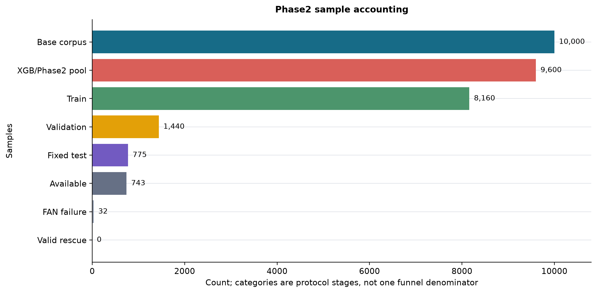
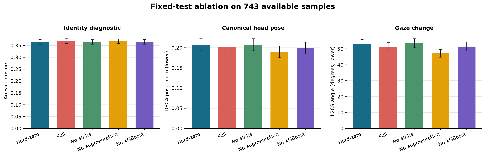
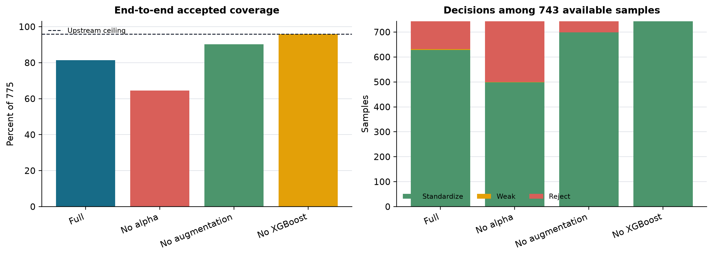
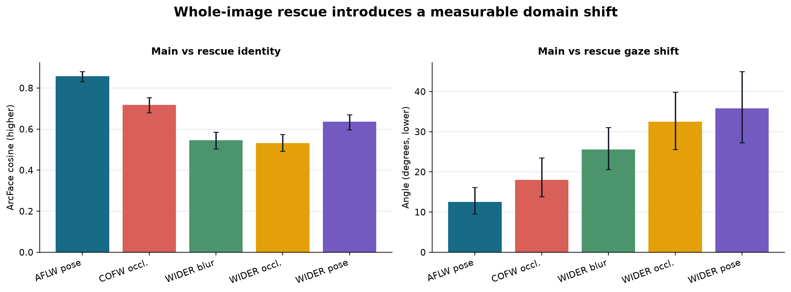
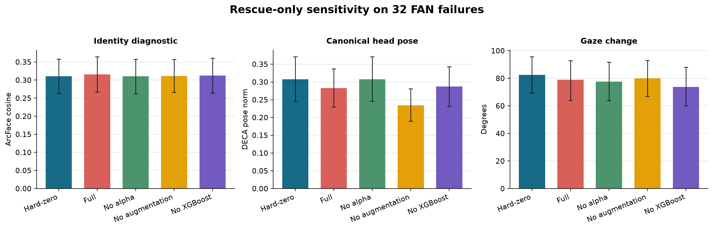
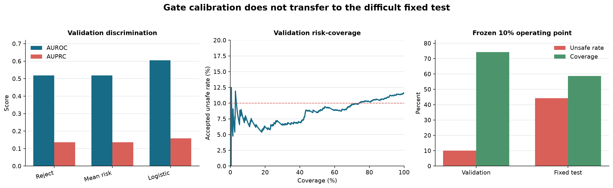

# Phase2 Final Experimental Report

## Material Passport

- Artifact: Phase2 final experiment report
- Project: DECA parameter-space face standardization
- Date: 2026-08-27
- Code baseline: `main@3ff9b7f8380d453e92ec14f683d886640cc5d8bc`
- Experiment host: RTX 5060 Laptop, Windows
- Verification status: `VERIFIED` for protocol execution and artifact hashes; `ANALYZED` for scientific interpretation
- Evidence boundary: ArcFace, re-encoded DECA, and L2CS metrics are diagnostic measurements on DECA shape-detail renders, not human perceptual ground truth

## Executive Status

Phase2 v1 is experimentally complete. Data exclusion, fixed splits, four-model training, fixed-test rendering, paired ablation, rescue sensitivity, validation-only gate calibration, frozen fixed-test audit, final figures, and critical-artifact hashes have all been completed.

The scientific result is mixed:

- The Full model produces a small but repeatable improvement over hard-zero in identity diagnostic, head-pose canonicalization, and gaze preservation.
- Learned alpha is useful, but the effect size is modest.
- Augmentation does not improve the fixed-test diagnostic outcomes in the current implementation.
- Whole-image rescue restores extraction technically but causes a substantial preprocessing-domain shift; none of the 32 rescue-only cases meets the registered valid-rescue rule.
- The validation-trained gate does not transfer to the deliberately difficult fixed test and is not deployment-qualified.

Therefore Phase2 v1 should be frozen as a research baseline, not presented as a production-ready standardization system.

## Experimental Position

The project is at the boundary between Phase2 closure and a Phase2.1 safety/objective redesign:

1. Phase1 extraction, quality screening, BUG-003 correction, and parity recovery are complete.
2. Phase2 parameter-space condition generation and its planned evaluation protocol are complete.
3. Phase2 safety claims are not complete: identity non-inferiority, fallback robustness, and gate transfer are not established.
4. Downstream condition-map or image-generation training may start only as exploratory work. It should not consume rescue outputs or treat the current gate as a reliable safety filter.

## Protocol Accounting

| Item | Result |
|---|---:|
| Base corpus | 10,000 |
| Fixed-test exclusions from XGBoost/Phase2 pool | 400 |
| Phase2/XGBoost pool | 9,600 |
| Training split | 8,160 |
| Validation split | 1,440 |
| Fixed test | 775 |
| Primary FAN/DECA available | 743 |
| Upstream FAN failures | 32 |
| Train/test ID overlap | 0 |
| Formal trained models | 4 |
| Fixed-test render methods | 6 |

All four models use the same validation IDs. Validation augmentation is disabled, validation is deterministic, the normalizer is fitted on the unaugmented training subset only, and the 400 base fixed-test IDs are excluded from the 9,600-row training pool.

## Primary Ablation Result

On the 743 fixed-test samples that reach Phase2, Full versus hard-zero gives:

| Diagnostic | Paired mean difference, Full minus hard-zero | 95% paired-bootstrap CI | Interpretation |
|---|---:|---:|---|
| ArcFace cosine | +0.00359 | [+0.00146, +0.00574] | Small identity-diagnostic improvement |
| DECA head-pose norm | -0.00525 | [-0.00961, -0.00072] | Small move toward canonical pose |
| L2CS gaze change | -1.96 degrees | [-3.80, -0.18] | Small reduction in gaze change |
| DECA pose change from original | +0.00261 | [-0.00139, +0.00675] | No clear difference |

The absolute mean ArcFace cosine is 0.3688 for Full and 0.3652 for hard-zero. The difference is statistically stable under the paired bootstrap, but it is small in practical magnitude and does not establish perceptual identity preservation.

Learned alpha matters: No-alpha is effectively indistinguishable from hard-zero, while Full improves ArcFace cosine by 0.00363 and reduces head-pose norm by 0.00534 relative to No-alpha. However, No-augmentation has lower pose norm and lower gaze change than Full without a clear identity difference. The current augmentation policy therefore is not supported as beneficial by this fixed test.

XGBoost mainly changes the decision policy. No-XGBoost accepts all 743 available samples, while Full accepts 631 and reaches 81.42% end-to-end accepted coverage over the 775 denominator. This coverage reduction is not justified as a safety gain because the later outcome audit shows poor gate transfer.

## Rescue Result

The 343 paired main/rescue cases show that whole-image warp is not equivalent to FAN preprocessing:

| Diagnostic | Result |
|---|---:|
| Main-rescue ArcFace cosine, mean | 0.6651 |
| Main-rescue gaze difference, mean | 24.12 degrees |
| Main-rescue gaze difference, p95 | 80.90 degrees |
| Expression RMSE, mean | 0.1203 |
| Head-pose L2, mean | 0.1910 |
| Rescue-minus-main XGBoost score, mean | +0.0250 |

The shift is largest in WIDER blur, occlusion, and pose subsets. Rescue must remain a separately labelled preprocessing domain.

For the 32 primary FAN failures, rescue technically produces 32 finite MAT files and all six rendering methods succeed. Nevertheless, Full has mean ArcFace cosine 0.3157 relative to rescue-original and mean gaze change 78.99 degrees. The frozen audit labels 16 unsafe, 16 safe-but-ineffective, and 0 safe-and-effective. Only three are weakly accepted, including two unsafe cases.

Under the registered rule `available AND gate accepted AND safe-and-effective`, valid rescue is 0/32. Primary-only and primary-plus-rescue scientific coverage are both 743/775, or 95.87%.

## Gate Result

The 1,440 validation renders produce 167 unsafe outcomes, 1,270 safe-but-ineffective outcomes, and 3 safe-and-effective outcomes under the frozen engineering margins. The existing reject score is nearly non-discriminative for observed outcomes:

| Gate score | AUROC | AUPRC | Brier | ECE |
|---|---:|---:|---:|---:|
| Reject score | 0.5184 | 0.1364 | 0.1330 | 0.1616 |
| Mean risk | 0.5182 | 0.1363 | 0.1330 | 0.1616 |
| Logistic calibrator | 0.6049 | 0.1590 | 0.1018 | 0.0127 |

The logistic calibrator improves ranking and probability calibration modestly. At the validation operating point constrained to 10% accepted-set unsafe rate, coverage is 74.31%.

When coefficients and thresholds are frozen and applied once to the 743 available fixed-test samples, coverage falls to 58.68% and accepted-set unsafe rate rises to 44.27%. FAR is 60.69% and FRR is 42.82%. The validation target therefore does not transfer to the difficult fixed-test composition.

The gate is a useful failure diagnosis, not a deployable safety mechanism. It should not be retuned on the 775 fixed test.

## Research Conclusions

### Supported

1. A learned, quality-aware alpha can soften hard-zero standardization and produce small paired improvements in the current render-domain diagnostics.
2. The Phase2 training and evaluation protocol is reproducible: splits are fixed, leakage is excluded, validation is deterministic, failures remain in denominators, and paired bootstrap is keyed by `eval_id`.
3. Preprocessing provenance is a first-order variable. FAN crop and whole-image rescue create measurably different DECA, ArcFace, gaze, and XGBoost observations.

### Partially Supported

1. Phase2 reduces head-pose norm, but the practical gain over hard-zero is small.
2. Identity preservation is better than hard-zero in paired analysis, but absolute render-domain cosine remains low and no human/perceptual non-inferiority study has been performed.
3. XGBoost is useful as an input-quality descriptor, but its present use in gating does not yield a transferable safety decision.

### Not Supported

1. Whole-image rescue cannot be treated as an equivalent fallback for FAN.
2. The present augmentation policy cannot be claimed to improve robustness.
3. The current proxy-trained reject/confidence heads and post-hoc calibrator cannot be claimed to identify unsafe standardization reliably outside the validation distribution.
4. Phase2 v1 cannot be called deployment-ready.

## Limitations and Fallacy Scan

| Risk | Handling |
|---|---|
| Statistical significance mistaken for practical importance | Full effects are reported as small despite paired CIs excluding zero. |
| Confidence interval mistaken for equivalence | No equivalence claim is made; margins were engineering thresholds. |
| Test-set threshold tuning | Gate thresholds were frozen on validation and applied once to fixed test. |
| Distribution shift | Validation-to-fixed and FAN-to-rescue shifts are reported explicitly. |
| Proxy metric treated as ground truth | ArcFace/DECA/L2CS results are labelled diagnostic only. |
| Missingness assumed random | The 32 FAN failures remain in the denominator and are analysed separately. |
| Independent-sample analysis applied to paired methods | Method comparisons use paired `eval_id` bootstrap. |
| Multiple comparisons ignored | Ablations are treated as descriptive diagnostics; no universal superiority claim is made. |
| Class imbalance ignored | XGBoost and gate class counts are reported; AUPRC accompanies AUROC. |
| Correlation interpreted causally | No causal claim is made about XGBoost, alpha, or augmentation. |
| Rescue success equated with scientific validity | Technical recovery and valid rescue are reported separately. |

## Completion Assessment

- Phase2 v1 planned experimental protocol: **100% complete**.
- Phase2 v1 reproducibility packaging: **100% complete** for the declared critical-artifact scope.
- Phase2 scientific objective: **partially met**. Parameter standardization is supported; identity safety, rescue robustness, and gate transfer are not.
- Deployment readiness: **not met**.

This distinction is important: more runs of the same protocol are not required to close Phase2 v1. Further work is a new Phase2.1 model/safety iteration rather than unfinished Phase2 v1 housekeeping.

## Next Stage

The recommended order is:

1. Freeze and tag Phase2 v1 as an experimental baseline. Do not alter the 775 fixed-test thresholds or denominators.
2. Build a new, independent hard calibration set using primary face detection and disjoint identities/domains. Do not use rescue preprocessing as ordinary training data.
3. Replace proxy gate targets with OOF outcome-derived labels. Predict unsafe standardization directly and evaluate transfer before choosing operating points.
4. Add an identity-aware objective or constraint to Phase2 training, preferably on differentiable rendered outputs, while preserving non-standardized DECA parameters.
5. Redesign augmentation using crop/landmark perturbations that match observed FAN uncertainty; keep an explicit preprocessing-provenance feature.
6. Evaluate textured or photorealistic reconstructions and add a blinded human identity/quality audit before making perceptual claims.
7. Start downstream condition-map or generator training only after defining how rejected samples are excluded and after the revised gate passes an independent transfer test.

Suggested promotion criteria for Phase2.1 should be preregistered on the new calibration set: accepted-set unsafe rate at most 10%, useful coverage, identity non-inferiority, and zero silent preprocessing fallback. Exact margins require repeatability and human-perceptual calibration rather than selection on the current fixed test.

## Artifact Integrity

- Hash algorithm: SHA-256
- Critical artifacts: 66
- Verified: 66/66
- Manifest: `artifact_sha256.csv`
- Summary: `artifact_hash_summary.json`
- Excluded by scope: raw datasets, external model dependencies, per-image renders, caches, and virtual environments

The manifest binds the four trained checkpoints, normalizers, split IDs, XGBoost model and predictions, fixed manifests, core ablation/rescue/gate metrics, and final figures. Per-image rendering files are represented by their render manifests and aggregate metrics rather than individually hashed.
